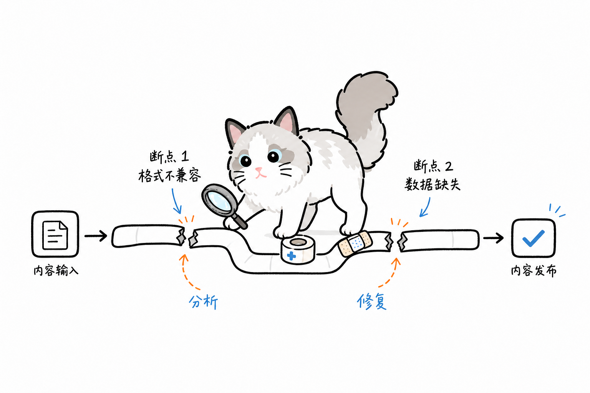
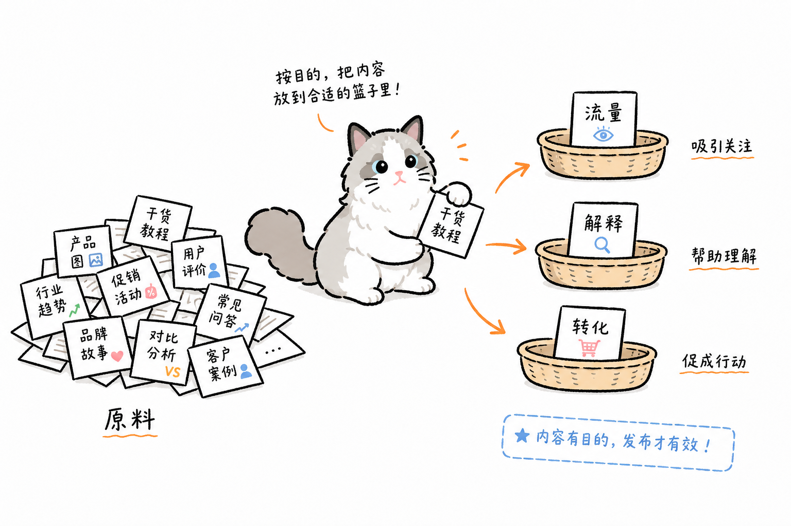
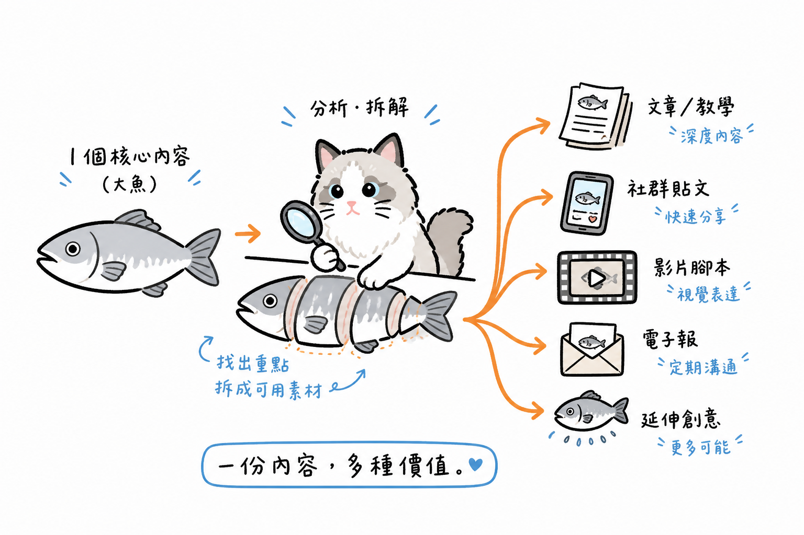
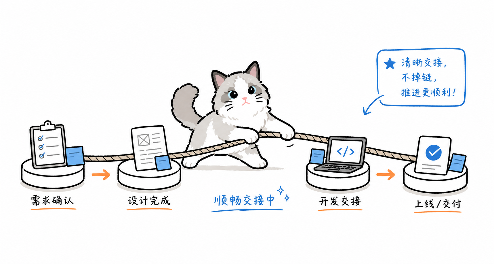
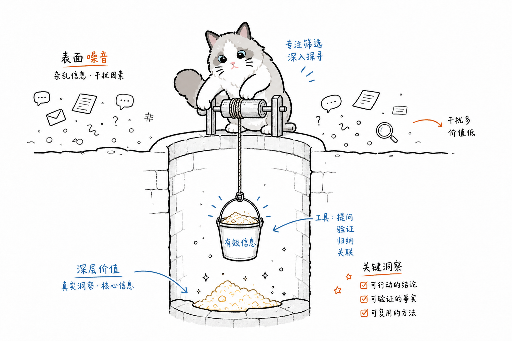
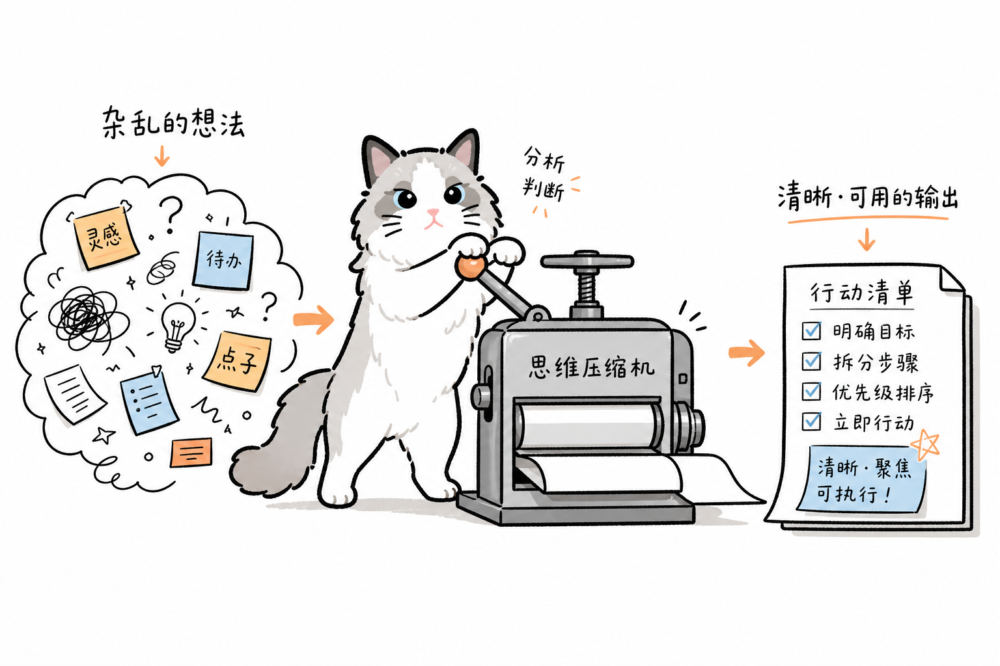
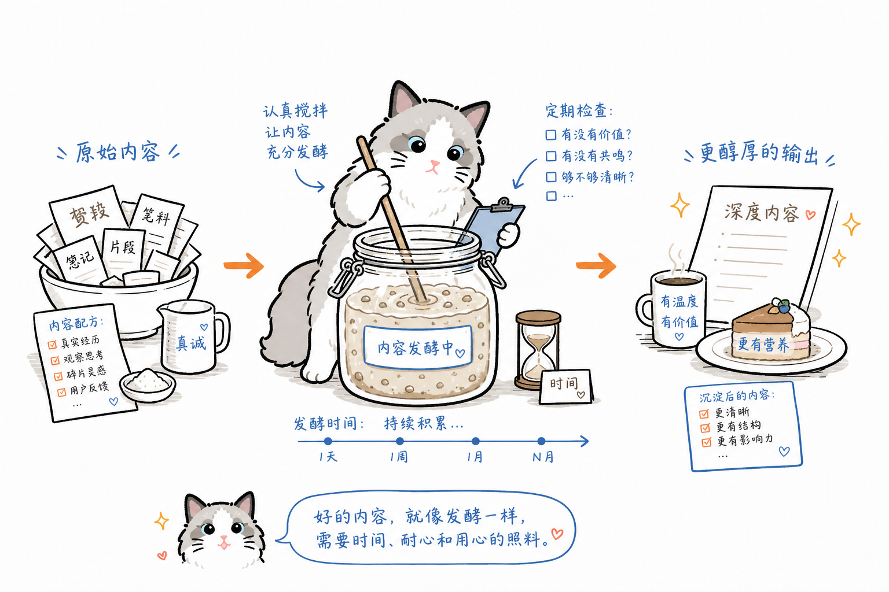
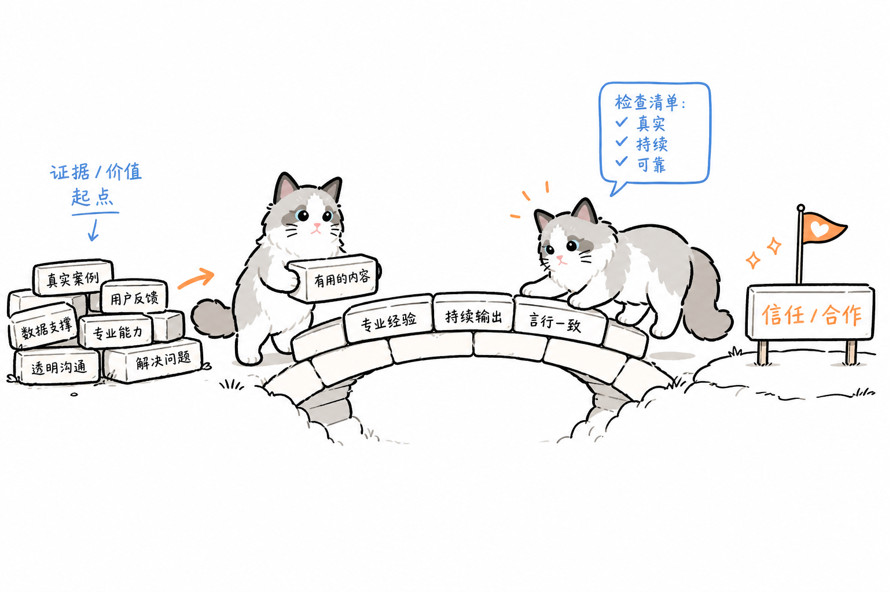

# Ian Chouchou Cat Illustrations

> 把中文文章里的判断、流程、状态和隐喻，变成一张张白底、手绘、怪诞但清爽的正文配图。
>
> 16:9 横版 | 臭臭猫 IP | 纯白手绘 | 少量红橙蓝中文批注 | Codex Skill

---

## 这个仓库是什么

Ian Chouchou Cat Illustrations 是一个 Codex Skill，用来指导 AI Agent 为中文文章、帖子、博客、Notion 文档和方法论内容生成正文配图。

它沿用原始 Ian 配图 skill 的工作流逻辑、构图逻辑和风格 DNA，但固定视觉 IP 已切换为 **臭臭猫 / mychouchou** —— 一只聪明负责、可爱、眼里有活的布偶小男猫。

一句话：**让 AI 不只是“配一张图”，而是让臭臭猫把文章里的一个关键认知动作亲自做出来。**

---

## 适合谁用

特别适合：

- 写中文文章，需要正文配图和文章插图的人
- 做知识型内容、方法论内容、AI 工作流内容的人
- 想把抽象判断画成具体隐喻的人
- 想要一种比 PPT 信息图更轻、更怪、更有个人识别度的配图风格的人
- 用 Codex 做内容生产，希望稳定复用一套视觉语言的人

不适合：

- 想要商业插画、品牌 KV 或精致扁平插画的人
- 想要传统 PPT 信息图、复杂架构图或流程图的人
- 想要儿童卡通、纯卖萌 IP、表情包风格的人
- 想把大量正文、长段解释或完整课程页塞进一张图里的人
- 需要严格可编辑矢量源文件的人

---

## 它会产出什么

默认输出：

- 16:9 横版正文配图
- 一篇文章的 4-8 张 shot list
- 每张图的主题、核心意思、结构类型、臭臭猫动作和中文标注建议
- 最终 PNG 图片，保存到 workspace 的 `assets/<article-slug>-illustrations/`

默认不输出：

- PPTX / PDF / Keynote
- SVG / HTML / Canvas 可编辑图
- 商业海报或封面 KV
- 大段文字型信息图

---

## 视觉风格

这个 skill 默认使用 Ian 的“臭臭猫怪诞正文配图”风格：

- 纯白背景，不要纸纹、米色、阴影、渐变
- 黑色手绘线稿，细线，轻微抖动
- 大量留白，主体只占画面约 40%-60%
- 少量红色、橙色、蓝色中文手写批注
- 一张图只表达一个核心动作、结构、状态或隐喻
- 臭臭猫必须参与核心动作，不能只是装饰
- 怪诞、有创意、清爽，但不幼稚、不卖萌

IP 锚点：

- 名字：`臭臭猫 / mychouchou`
- 一个词识别点：`狮偶`
- 描述短句：`聪明负责可爱眼里有活布偶小男猫一只`
- 内部判断标准：`先看见他在分析干活，再看见他可爱`
- 外形重点：布偶猫、圆脸、大圆蓝眼、奶灰白双色、中长毛躯干、蓬松尾巴、体型结实平衡

参考母版图：`assets/mychouchou-reference-sheet-01.png`

---

## 示例效果

### 两个断点



### 按目的分拣



### 一鱼多吃



### 承接路径



### 信息井



### 想法压机



### 内容发酵



### 信任桥



这些图片是风格校准样例，不是构图模板。使用时应该从当前文章重新发明隐喻，不要照抄旧案例的物件和构图。

---

## 怎么用

### 只做配图规划

```text
Use $ian-mychouchou-illustrations 先不要生图。
请分析下面这篇文章哪里值得配图，输出 5 张左右的 shot list。
每张图写清楚：放在哪段后、主题、核心意思、结构类型、臭臭猫在做什么、建议中文标注词。

<粘贴文章>
```

### 直接生成正文配图

```text
Use $ian-mychouchou-illustrations 把下面这篇文章生成 4 张臭臭猫怪诞正文配图。
要求：16:9 横版、纯白背景、黑色手绘线稿、少量红橙蓝中文手写批注。

<粘贴文章>
```

### 为单个概念生成一张图

```text
Use $ian-mychouchou-illustrations 为“信任不是喊出来的，而是一块证据一块证据铺过去”生成一张正文配图。
画面要怪诞但清爽，臭臭猫必须承担核心动作。
```

### 去掉图里的标题或错误文字

```text
Use $ian-mychouchou-illustrations 帮我编辑这张图，去掉左上角的“流程图”标题，其他内容保持不变。
```

更多示例见 [examples/prompts.md](examples/prompts.md)。

---

## 安装

克隆仓库：

```bash
git clone https://github.com/ylxj-blip/ian-mychouchou-illustrations.git
cd ian-mychouchou-illustrations
```

复制 skill 到 Codex skills 目录：

```bash
mkdir -p "${CODEX_HOME:-$HOME/.codex}/skills"
cp -R ./ian-mychouchou-illustrations "${CODEX_HOME:-$HOME/.codex}/skills/"
```

安装后，在 Codex 里使用：

```text
Use $ian-mychouchou-illustrations 为这篇中文文章设计并生成 5 张臭臭猫怪诞正文配图。
```

---

## 工作流程

这个 skill 的流程是：

1. 读取文章、Markdown、Notion 内容、截图或用户给的主题
2. 提炼核心观点、认知转折、逻辑关系和适合视觉化的段落
3. 先判断结构关系：层级、交集、二维分类、并列分组、流程路径等
4. 先输出 shot list：每张图只选一个认知锚点和一个主结构
5. 重新发明一个低科技、怪诞但成立的物理隐喻
6. 让臭臭猫承担核心动作
7. 默认优先少字版 / 无标题版；严肃信息图优先生成“可后加字”的骨架图
8. 每张图单独调用图像模型生成
9. 按 QA checklist 检查：白底、留白、臭臭猫动作、中文标注、非 PPT 感、非旧案例复刻
10. 保存最终 PNG，并报告用途和路径

---

## 目录结构

```text
.
├── README.md
├── LICENSE
├── NOTICE.md
├── assets/
│   ├── ian-wechat-qr.jpg
│   └── mychouchou-reference-sheet-01.png
├── examples/
│   ├── images/
│   │   ├── 01-two-breakpoints.png
│   │   ├── 02-sort-by-purpose.png
│   │   └── ...
│   └── prompts.md
├── ian-mychouchou-illustrations/
│   ├── SKILL.md
│   ├── agents/
│   │   └── openai.yaml
│   └── references/
│       ├── mychouchou-ip.md
│       ├── composition-patterns.md
│       ├── prompt-template.md
│       ├── qa-checklist.md
│       └── style-dna.md
└── outputs/
    └── chouchou-replacements/
```

真正需要安装到 Codex 的是子目录：

```text
ian-mychouchou-illustrations/
```

根目录的 README、LICENSE、NOTICE、examples 和 outputs 是 GitHub 分享文档。

---

## 注意事项

- 图片里的中文文字越短越稳定。
- 每张图只讲一个核心结构，不要把文章做成说明书。
- 臭臭猫必须承担核心动作；如果去掉臭臭猫画面仍然完全成立，说明臭臭猫太装饰了。
- 示例图只用于校准线条密度、留白、颜色克制和臭臭猫参与方式，不要复刻构图。
- AI 图像模型可能出现错字、幻觉标签、风格漂移或多余标题，生成后需要检查。
- 如果中文错字严重，优先减少标注词并重生成。
